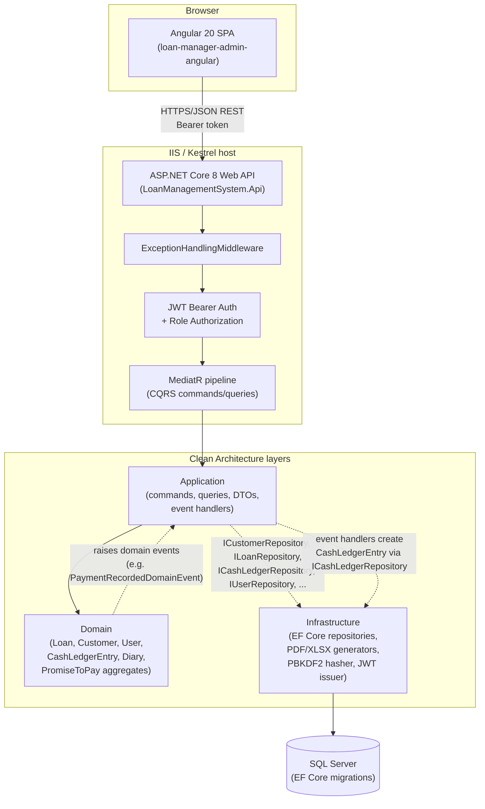

# Architecture — Loan Management System

> Generated by inspecting the actual source tree (`src/`, `tests/`, config
> and manifest files, `.claude/skills/deploy-to-iis`) as of 2026-08-22.
> Every non-obvious claim below cites the file it was pulled from. Anything
> that could not be determined from the repository is marked **TODO: confirm**
> rather than assumed.
>
> **Note on stale docs in this repo**: `README.md`, `src/loan-manager-admin-angular/README.md`,
> and `TESTING.md` were written before the code was ever compiled (see
> `README.md:10-15`) and contain claims that no longer match the code — e.g.
> `TESTING.md:57` says "MySQL" but the project is wired to SQL Server
> (`appsettings.json`, `LoanManagementSystem.Infrastructure.csproj`).
> `Product-Requirements-Document-PRD.md` at the repo root describes an
> unrelated product ("Vetra AI", a veterinary platform) and appears to be
> leftover/mismatched content — it was **not** used as a source for this
> document. This document was written from the actual `.cs`/`.ts`/`.json`
> source files, not from any of the above.

---

## 1. Overview

This is an internal **admin back-office system for a small fixed-term
individual lending business** (a "5-6"-style micro-lender), not a
consumer-facing or marketplace lending product. It supports:

- **Customer management** — profiles, contact info, notes, and per-customer
  document uploads (ID, business permit, agreement, photos) stored as binary
  blobs in SQL Server (`CustomerDocument`, see §3).
- **Loan origination** — fixed 60-day terms by default, flat (non-compounding)
  3% interest, configurable payment-terms-in-months, computed at creation via
  `Loan.Originate()` (`src/LoanManagementSystem.Domain/Loans/Loan.cs`).
- **Manual loan extensions** — push out the due date and add a flat
  extension fee (`Loan.Extend()`), independent of interest recalculation.
- **Servicing / repayment** — partial and multiple payments per loan, with
  running balance recalculation (`Loan.RecordPayment()`).
- **Collections workflow** — a manual `LoanClassification` (Normal /
  WatchList / BadLoan) separate from the system-derived `LoanStatus`
  (Active / Extended / Paid / Overdue / WrittenOff) — see
  `Loans/LoanClassification.cs` and `Loans/LoanStatus.cs`. There is also a
  **Diary/Calendar module** (follow-ups, reminders, financial snapshots) and
  a **Promise-to-Pay module** (tracks borrower promises, kept/missed/rescheduled/cancelled)
  used to manage collections activity.
- **Cash ledger / funds tracking** — a *separate* aggregate from Loans
  (`CashLedgerEntry`) that records owner deposits/withdrawals/expenses plus
  automatic entries created from loan events (loan release, payment
  received) via domain events — see §"Domain-event pattern" below.
- **Reporting** — Interest Earned report (overview, monthly chart, per-loan
  breakdown, paged table, PDF/XLSX export), customer summary, period
  summary/CSV export, cash ledger XLSX export, loans/customers/payments XLSX
  export, and a QuestPDF-generated Statement of Account per loan.
- **Auth & role-gating** — JWT-based login with two roles, Admin and Staff,
  gating loan creation/extension, customer creation, cash-ledger writes, and
  user management to Admin only (`README.md:31-34`, controller
  `[Authorize(Roles = "Admin")]` attributes).

There is **no underwriting/credit-scoring, no external payment processing,
no KYC/identity-verification integration, and no borrower-facing portal** —
this is purely a staff-operated administrative tool for a lender who already
decided to lend; see §5 for the (empty) result of searching for third-party
financial integrations.

### High-level architecture

Two independently deployable halves in one repository/solution: an Angular
SPA and a .NET 8 Web API, talking over plain HTTP(S) JSON REST — no shared
runtime, no server-side rendering, no BFF layer. `[1]`

`[1]` `LoanManagementSystem.sln`, `CLAUDE.md` "Project" section.

---

## 2. Tech Stack

| Component | Technology | Version | Source |
|---|---|---|---|
| Backend runtime/language | .NET / C# | .NET 8 (`net8.0`) | `src/LoanManagementSystem.Api/LoanManagementSystem.Api.csproj:4` |
| Backend web framework | ASP.NET Core Web API (`Microsoft.NET.Sdk.Web`) | 8.0 | `LoanManagementSystem.Api.csproj:1` |
| CQRS / mediator | MediatR | 12.4.1 | `LoanManagementSystem.Application.csproj:11`, `Infrastructure.csproj:18` |
| ORM | Entity Framework Core (SQL Server provider) | 8.0.10 | `Infrastructure.csproj:12,17` |
| Auth | `Microsoft.AspNetCore.Authentication.JwtBearer` + `System.IdentityModel.Tokens.Jwt` | 8.0.10 / 8.2.1 | `Api.csproj:12`, `Infrastructure.csproj:20` |
| API docs | Swashbuckle (Swagger/OpenAPI) | 6.6.2 | `Api.csproj:17` |
| PDF generation | QuestPDF | 2026.7.2 | `Infrastructure.csproj:19` |
| XLSX generation | ClosedXML | 0.105.1 | `Infrastructure.csproj:11` |
| Frontend framework | Angular (standalone components) | ^20.3.0 | `src/loan-manager-admin-angular/package.json:25-33` |
| Frontend language | TypeScript | ~5.9.2 | `package.json:49` |
| UI component library | Angular Material + CDK | ^20.2.0 | `package.json:26,31` |
| Frontend state | RxJS + Angular signals (no NgRx/Redux found) | ~7.8.0 | `package.json:34` |
| Frontend build tool | `@angular/build` (esbuild-based application builder) | ^20.3.32 | `package.json:39`; `angular.json:22` (`"builder": "@angular/build:application"`) |
| Frontend test runner | Karma + Jasmine | ~6.4.0 / ~5.9.0 | `package.json:44-48` |
| Package managers | NuGet (backend), npm (frontend) | — | `*.csproj` files; `package-lock.json` |
| Solution/workspace | Single `.sln` for all 4 backend projects + 3 test projects; single Angular CLI workspace (not an Nx/Turborepo monorepo) | — | `LoanManagementSystem.sln`, `angular.json` |

**API style**: REST over JSON, camelCase on the wire
(`Program.cs:32` `JsonNamingPolicy.CamelCase`), documented via Swashbuckle's
generated OpenAPI, exposed at `/swagger` **only when
`ASPNETCORE_ENVIRONMENT=Development`** (`Program.cs:155-159`). No GraphQL,
no gRPC found anywhere in the repo.

**Runtime prerequisite** (not in any manifest, inferred from `net8.0`
target): **.NET 8 SDK/Runtime**. **TODO: confirm** exact patch version
expected in production beyond "8.0.10-compatible" (no `global.json` pins a
specific SDK build).

---

## 3. Database & Data Layer

| Aspect | Detail | Source |
|---|---|---|
| Engine (dev/prod) | Microsoft SQL Server (Windows/integrated auth by default) | `appsettings.json:3` `Trusted_Connection=True`; `Microsoft.EntityFrameworkCore.SqlServer` package |
| Engine (automated tests) | SQLite in-memory (`DataSource=:memory:`), swapped in only for `LoanManagementSystem.Api.Tests` | `tests/LoanManagementSystem.Api.Tests/TestApiFactory.cs:24,39` |
| Default dev database name | `lending-db` | `appsettings.json:3` |
| Production database name | `Loans` | `appsettings.Production.json:3` |
| ORM | EF Core 8, code-first, one `IEntityTypeConfiguration<T>` per aggregate under `Infrastructure/Persistence/Configurations/` | `CLAUDE.md`; `Infrastructure/Persistence/Configurations/*.cs` |
| Migrations | Real EF Core migrations exist and are checked in (23 migration files from `InitialCreate` 2026-08-05 through `AddAppSettingsAndExplicitDateTime2` 2026-08-20) | `src/LoanManagementSystem.Infrastructure/Persistence/Migrations/*.cs` |
| Schema application at startup | `DbSeeder.EnsureSchemaAsync` — replays real migrations (`MigrateAsync`) whenever the provider isn't SQLite and migrations exist; falls back to `EnsureCreatedAsync()` for SQLite (tests) or if no migrations are present | `Infrastructure/Persistence/Seed/DbSeeder.cs:34-54` |
| Retry policy | `EnableRetryOnFailure()` on the SQL Server EF provider | `Infrastructure/DependencyInjection.cs:24-26` |
| Connection resilience/pooling | Standard EF Core/ADO.NET connection pooling (no custom pool config found) | — |

**Money/date modeling**: monetary values use a custom `Money` value object
mapped to SQL `decimal(12,2)`; interest rate is `decimal(5,4)`; loan/payment
dates use C#'s `DateOnly` mapped to SQL `date`; timestamps use `datetime2`
(`Infrastructure/Persistence/Configurations/LoanConfiguration.cs:37-56`,
`UserConfiguration.cs:34`). No caching layer (Redis/Memcached/in-memory
distributed cache) was found anywhere in either project's package
references or DI registrations.

### PII / financial / document data

- **Customer PII**: name, address, phone, occupation, nickname, free-text
  notes (`Domain/Customers/Customer.cs`, not fully quoted here — see
  `DbSeeder.cs:61-65` for the field shape via seed data).
- **Identity/support documents**: `CustomerDocument` and `LoanDocument` child
  entities store **file content directly in SQL Server as `VARBINARY(MAX)`**
  — the code comment is explicit that this is a deliberate spec requirement
  ("do not store files in the server file system"):
  `Domain/Customers/CustomerDocument.cs:6-13`,
  `Infrastructure/Persistence/Configurations/CustomerDocumentConfiguration.cs:28-29`,
  `LoanDocumentConfiguration.cs:28`. There is no external blob storage
  (S3/Azure Blob/etc.) integration anywhere in the codebase.
- **Loan/payment financial data**: principal, interest rate, balances,
  payment method (`Cash`/`GCash` — see `PaymentMethod.cs`), all held
  directly in SQL Server tables, no separate PCI-scope payment vault (this
  system never touches card data — payments are recorded after the fact,
  not processed).
- **Password storage**: PBKDF2-SHA256, 100,000 iterations, per-user random
  salt, output format `"{iterations}.{salt}.{hash}"`, constant-time
  comparison on verify (`Infrastructure/Security/Pbkdf2PasswordHasher.cs`).
- **Encryption at rest**: no application-level encryption (e.g. Always
  Encrypted, column-level encryption, TDE) is configured in any `.cs`/`.json`
  file in this repo. If SQL Server Transparent Data Encryption or disk-level
  encryption is used, it would be a SQL Server instance setting outside this
  repository. **TODO: confirm** whether TDE or any at-rest encryption is
  enabled on the actual SQL Server instance.
- **Backups / retention**: no backup or data-retention policy, job, or
  script exists in the repository. **TODO: confirm** backup schedule/policy
  — this is described as "external to this codebase" even in the project's
  own `TESTING.md:57`.

---

## 4. Authentication & Security

| Aspect | Detail | Source |
|---|---|---|
| Auth mechanism | Stateless JWT Bearer tokens, HMAC-SHA256 signed | `Infrastructure/Security/JwtTokenGenerator.cs:33-41` |
| Identity provider | None external — self-hosted `User` aggregate + `AuthController`/login command; no OAuth2/OIDC/SAML integration found | `Domain/Identity/User.cs`, `Api/Controllers/AuthController.cs` |
| Token claims | `sub` (user id), `ClaimTypes.Name` (username), `ClaimTypes.Role` (role) | `JwtTokenGenerator.cs:24-31`; `CLAUDE.md` |
| Token lifetime | 120 minutes (`Jwt:ExpiryMinutes`) | `appsettings.json:9` |
| Token validation | Issuer, audience, lifetime, signing key all validated; clock skew tightened to 30s (default is 5 min) | `Program.cs:72-83` |
| Roles | `Admin`, `Staff` (`UserRole` enum) — Staff can view everything and record payments, but cannot create/extend loans, create customers, manage users, or touch the cash ledger | `README.md:31-34`; per-controller `[Authorize(Roles = "Admin")]` (e.g. `CashFundsController.cs:65-66,74-75,83-84`, `UsersController.cs:27-35`) |
| Authorization pattern | Class-level `[Authorize]` (any authenticated user) + per-action `[Authorize(Roles = "Admin")]` override, enforced by ASP.NET Core's built-in authorization middleware | `CLAUDE.md`; controllers throughout `Api/Controllers/` |
| Password hashing | PBKDF2-SHA256 via built-in `Rfc2898DeriveBytes`, 100k iterations, constant-time verify | `Infrastructure/Security/Pbkdf2PasswordHasher.cs` |
| Secrets management | `dotnet user-secrets` recommended for local dev (`UserSecretsId` set in `Api.csproj:8`); production JWT secret is meant to be injected as an **IIS Application Setting** (`Jwt__Secret` env var via ANCM), never committed | `README.md:112-121`; `.claude/skills/deploy-to-iis/SKILL.md:242-246`; `web.config:9-15` (comment) |
| Committed placeholder secrets | `appsettings.json` ships a literal placeholder `Jwt:Secret` string that must be replaced before any real deployment | `appsettings.json:6`; flagged explicitly in `README.md:208-213` |
| Transport security | CORS restricts allowed origins (`http://localhost:4200` dev, configurable via `Cors:AllowedOrigins` — set to `http://loans.raa` in `appsettings.Production.json:6-7`); no HTTPS redirection middleware (`UseHttpsRedirection`) found in `Program.cs` — TLS termination is expected to happen at IIS/reverse-proxy level in production | `Program.cs:87-101,161`; `appsettings.Production.json` |
| Rate limiting | **None found** — no `AddRateLimiter`/`UseRateLimiter` or third-party rate-limiting package anywhere in the backend | Grep across `src/LoanManagementSystem.Api` |
| Audit logging | Application-level audit trails exist for Loans, Diary, and Promise-to-Pay (`LoanAuditLogEntry`, `DiaryAuditLogEntry`, `PromiseAuditLogEntry` — separate tables recording who did what and when), but there is **no centralized structured request/security logging** (no Serilog, no `AddHealthChecks`, only the framework's default `ILogger` used for unhandled exceptions) | `Domain/Loans/LoanAuditLogEntry.cs`, `Domain/Diary/DiaryAuditLogEntry.cs`, `Domain/Promises/PromiseAuditLogEntry.cs`; `Api/Middleware/ExceptionHandlingMiddleware.cs:18,44` |
| Fraud/anti-abuse checks | None found (not applicable — this is a manually operated back-office tool, not a self-service loan application flow) | — |
| Input validation | No FluentValidation or similar pipeline; validation is ad-hoc inside domain methods, which throw `DomainException` on invalid business state (mapped to HTTP 400) | `README.md:219-222`; `Api/Middleware/ExceptionHandlingMiddleware.cs:38` |

---

## 5. Third-Party Integrations

**None found.** A repository-wide search for payment processors, credit
bureaus, KYC/identity-verification providers, e-signature services,
email/SMS senders, and analytics SDKs (`Twilio`, `SendGrid`, `Stripe`,
`PayPal`, `Plaid`, credit bureau names, `DocuSign`, `smtp`, webhook
handlers, etc.) returned **zero matches** in either the backend or frontend
source. The only "external" dependencies are the NuGet/npm packages listed
in §2 (all local libraries — PDF/XLSX generation, JWT, EF Core — not
network-calling third-party services). Payment method on a recorded
payment is limited to `Cash` and `GCash` as a *label* only
(`Domain/Loans/PaymentMethod.cs`) — no GCash API integration exists; it is
manually recorded by staff after the fact.

If any such integration is planned but not yet implemented, **TODO:
confirm** with the product owner — nothing in the codebase indicates one.

---

## 6. Infrastructure & Deployment

| Aspect | Detail | Source |
|---|---|---|
| Hosting model (as built) | **Windows Server + IIS**, not a cloud-managed PaaS | `.claude/skills/deploy-to-iis/SKILL.md` (entire file); `web.config` (ANCM config); `src/LoanManagementSystem.Api/web.config` |
| Cloud provider | **None found** — no AWS/GCP/Azure SDKs, no `Dockerfile`, no Kubernetes manifests, no Terraform/Bicep/CloudFormation/ARM templates anywhere in the repo (confirmed by the deploy-to-iis skill's own survey: "no existing IIS scaffolding at all... zero hits" for `Dockerfile`, and this session's own search turned up none either) | `.claude/skills/deploy-to-iis/SKILL.md:10-12` |
| Containerization | None — the app runs as a framework-dependent IIS-hosted process (`dotnet publish`, no `--self-contained`) plus a static file site for the Angular build | `.claude/skills/deploy-to-iis/SKILL.md:299-304` |
| Backend hosting under IIS | ASP.NET Core Module v2 (ANCM), in-process hosting model, via auto-generated + custom `web.config` | `src/LoanManagementSystem.Api/web.config:8` (`hostingModel="inprocess"`) |
| Frontend hosting under IIS | Static site serving `dist/loan-manager-admin-angular/browser/`, with a URL Rewrite Module rule for SPA client-side routing fallback to `index.html` | `.claude/skills/deploy-to-iis/SKILL.md:266-288` |
| CI/CD | **None configured** — `.github/workflows/` exists but is empty (glob returned no files); no Azure Pipelines/Bitbucket Pipelines/Jenkins config found either | `.github/workflows` (empty) |
| Environments | `Development` (default via `launchSettings.json`, Swagger on, permissive CORS) and `Production` (`appsettings.Production.json` overrides connection string + CORS origins; `ASPNETCORE_ENVIRONMENT=Production` forced via `web.config`) — config differences are entirely ASP.NET Core's standard `appsettings.{Environment}.json` layering, no separate "staging" file present | `appsettings.Development.json`, `appsettings.Production.json`, `web.config:10` |
| Frontend environment config | `environment.ts` (dev, points at `http://localhost:5080/api`) vs. `environment.prod.ts` (points at `http://api.loans.raa/api`), swapped via Angular CLI `fileReplacements` in the `production` build configuration | `src/environments/environment.ts`, `environment.prod.ts`, `angular.json:60-65` |
| Deployment automation | Entirely manual, documented as a runbook in `.claude/skills/deploy-to-iis/SKILL.md` (PowerShell `New-WebAppPool`/`New-Website` commands, manual `dotnet publish`/`npm run build`, manual file copy) — no scripted/one-command deploy pipeline exists | `.claude/skills/deploy-to-iis/SKILL.md:296-388` |
| Redeployment | A separate skill (`.claude/skills/redeploy-to-iis`) covers pushing updates to an already-provisioned IIS instance without redoing first-time setup | `.claude/skills/redeploy-to-iis` (per its description in the skills listing) |

**Known production domain names** (from `appsettings.Production.json` and
`environment.prod.ts`): API at `http://api.loans.raa`, frontend origin
allowed via CORS at `http://loans.raa` — **both plain HTTP, not HTTPS**, and
`.raa` is not a public TLD, implying this is either an internal/lab DNS
name or a placeholder. **TODO: confirm** the real production domain, TLS
posture, and hosting location (on-prem vs. a specific cloud VM) — nothing in
the repo indicates where the IIS box physically/virtually runs.

---

## 7. Deployment Prerequisites

### Local development

| Requirement | Version / detail | Source |
|---|---|---|
| .NET SDK | 8.x | `*.csproj` `TargetFramework=net8.0` |
| SQL Server | 2019+ (per README), reachable locally or remotely | `README.md:99` |
| EF Core CLI tool | `dotnet tool install --global dotnet-ef` | `README.md:100` |
| Node.js / npm | Version matching Angular 20 toolchain (Angular 20 requires Node 18.19+/20.11+/22+ per Angular's own compatibility policy — **TODO: confirm** exact Node version pinned for this team, no `.nvmrc`/`engines` field found in `package.json`) | `package.json` (no explicit Node version pin) |
| Angular CLI | ^20.3.32 (devDependency, no global install required — invoked via `npx`/npm scripts) | `package.json:40` |

### Required configuration before first run

Backend (`src/LoanManagementSystem.Api/appsettings.json` or user-secrets):
- `ConnectionStrings:Default` — SQL Server connection string
- `Jwt:Secret` — must be replaced from the committed placeholder before any
  non-local use
- `Jwt:Issuer`, `Jwt:Audience`, `Jwt:ExpiryMinutes` — have working defaults
- `Cors:AllowedOrigins` — array of allowed frontend origin(s); defaults to
  `http://localhost:4200` if unset

Frontend (`src/loan-manager-admin-angular/src/environments/environment.ts` /
`environment.prod.ts`):
- `apiBaseUrl` — must point at the running backend's `/api` root

### Step-by-step local setup (as documented in the repo)

1. Install .NET 8 SDK, SQL Server, `dotnet-ef` CLI tool.
2. Configure `ConnectionStrings:Default` (prefer `dotnet user-secrets set`
   over editing `appsettings.json` directly).
3. From `src/LoanManagementSystem.Api`, run
   `dotnet ef database update --project ../LoanManagementSystem.Infrastructure --startup-project .`
   to apply the checked-in migrations (or skip this — `DbSeeder` falls back
   to `EnsureCreatedAsync()` against an empty database if no SQL Server
   connection/migrations are available yet).
4. Run `dotnet run --project src/LoanManagementSystem.Api` — listens on
   `http://localhost:5080`, opens `/swagger` in Development, seeds demo
   data (5 customers, 6 loans, cash ledger entries, `admin`/`Admin@12345`
   and `staff`/`Staff@12345` users) on first boot in Development only.
5. In `src/loan-manager-admin-angular`: `npm install`, then `ng serve` —
   listens on `http://localhost:4200`, already wired to
   `http://localhost:5080/api`.

`[Source: README.md §Setup, CLAUDE.md §Commands]`

---

## 8. Monitoring, Logging & Observability

- **Logging framework**: ASP.NET Core's built-in `Microsoft.Extensions.Logging`
  (`ILogger<T>`) only — no Serilog, NLog, or other structured-logging
  package referenced in any `.csproj`. Default log levels configured per
  environment in `appsettings.json`/`appsettings.Development.json`
  (`Information` default, `Warning` for `Microsoft.AspNetCore` and
  `Microsoft.EntityFrameworkCore`, `Information` for EF command logging in
  dev).
- **What gets logged**: only unhandled exceptions, centrally, via
  `ExceptionHandlingMiddleware.InvokeAsync` (`_logger.LogError(ex, ...)` for
  500-mapped exceptions only — 400/401/404-mapped exceptions are *not*
  logged, by design, since they represent expected client/business errors).
  No request/response access logging, no correlation IDs, found in the API
  project.
- **IIS-level logging**: `web.config`'s `<aspNetCore>` element supports
  `stdoutLogEnabled`/`stdoutLogFile`, currently set to `false` (disabled by
  default) with guidance to only enable temporarily for debugging, since
  it grows unbounded (`.claude/skills/deploy-to-iis/SKILL.md:412-416`).
- **Metrics/APM/error-tracking**: **none found** — no Application Insights,
  Datadog, Prometheus client, Sentry, CloudWatch, or any `Microsoft.ApplicationInsights.*`
  / `OpenTelemetry.*` package referenced anywhere.
- **Health checks**: **none found** — no `AddHealthChecks()`/`/health`
  endpoint in `Program.cs` or any controller.
- **Frontend**: no analytics or error-tracking SDK (no Google Analytics,
  no Sentry JS, etc.) found in `package.json` or `app.config.ts`.

**TODO: confirm** whether any monitoring/alerting is layered on
operationally outside this repo (e.g. Windows Event Log monitoring on the
IIS box, SQL Server Agent alerts) — nothing in the code indicates it.

---

## 9. Scalability & Reliability Considerations

- **Async job queues / background workers**: none found. All work is
  request-synchronous; the closest thing to a "job" is `Program.cs`'s
  startup-time sequence (`DbSeeder.EnsureSchemaAsync` →
  `SeedAsync` (dev only) → `BackfillLoanLedgerAsync` →
  `SeedDiaryCategoriesAsync` → `SeedDefaultSettingsAsync` →
  `businessTimeZoneCache.RefreshAsync`), which runs once per process start,
  not on a recurring schedule (`Program.cs:106-146`).
- **Domain events, not a message broker**: cross-aggregate side effects
  (e.g. a payment creating a cash-ledger entry) are implemented via
  MediatR's in-process `INotification` publishing, collected by
  `AppDbContext.SaveChangesAsync` and dispatched synchronously in the same
  request — **not** a durable queue (no RabbitMQ/Azure Service Bus/etc.).
  Each event handler does its own separate `SaveChangesAsync` call, which
  the project's own docs flag as **not atomic**: "each domain event's
  effect is its own database round trip... not wrapped in the same
  transaction as the change that raised it" (`README.md:87-93`,
  `CLAUDE.md`'s "domain-event pattern" section). If the process crashes
  between the two `SaveChangesAsync` calls, a loan payment could be
  recorded without its corresponding cash-ledger entry (or vice versa for
  loan origination) — a real, acknowledged trade-off, not a hidden bug.
- **Idempotency**: seeding operations (`DbSeeder.SeedAsync`,
  `SeedDiaryCategoriesAsync`, `SeedDefaultSettingsAsync`,
  `BackfillLoanLedgerAsync`) are explicitly idempotent (checked via
  existence queries before insert). Ordinary write commands (create loan,
  record payment, add cash transaction) have **no idempotency-key
  mechanism** — a double-submitted POST (e.g. a double-click or client
  retry) would create a duplicate record; this is a real gap for a
  financial system, not addressed anywhere in the code found.
- **Retry handling**: only at the EF Core/SQL connection level
  (`EnableRetryOnFailure()` — transient network/connection retries), no
  application-level retry/circuit-breaker (no Polly package referenced).
- **Overdue-status computation**: `LoanStatus.Overdue` is computed on every
  read (`Loan.RefreshOverdueStatus()` inside `GetLoansQuery`), not stored or
  updated by a scheduled job — the code's own comment flags this as
  "fine at this scale, worth revisiting with a scheduled job if the loan
  volume grows large enough" (`README.md:228-235`).
- **Single points of failure**:
  - Single SQL Server instance, no read replica or failover mentioned
    anywhere in config.
  - Single IIS app pool per app (no load balancer / multi-instance
    deployment described in the deploy runbook).
  - JWT secret and DB credentials are both single points of
    compromise/failure if leaked — no key rotation mechanism exists (a new
    secret would immediately invalidate all outstanding tokens, since
    there's no key-versioning in `JwtTokenGenerator`).
  - `DbSeeder`'s demo-data seeding path only checks `Customers` non-empty
    before seeding in dev — documented as "actively harmful" if ever
    triggered in Production against a since-cleared `Customers` table
    (`.claude/skills/deploy-to-iis/SKILL.md:56-62`); mitigated by gating
    `SeedAsync` behind `IsDevelopment()` in `Program.cs:120-124`.
- **Load/performance testing**: none found in the repo (`TESTING.md:56`
  explicitly states "No load/perf testing performed").

---

## 10. Open Questions / Gaps

The following could not be determined from the repository and should be
confirmed with whoever owns the deployment/operations:

1. **Physical/cloud hosting location** — the repo only shows an IIS
   deployment runbook targeting `http://loans.raa` / `http://api.loans.raa`
   (non-public TLD, plain HTTP). Whether the IIS box is on-prem, a VM in a
   cloud provider, or a lab machine is not stated anywhere in code.
2. **TLS/HTTPS termination** — no HTTPS redirection or TLS config is present
   in the application; if this exists it must be an IIS site binding or
   reverse-proxy configuration outside the repo.
3. **Production SQL Server sizing, HA/failover, and backup/retention
   policy** — none of this is described in any config file; `TESTING.md`
   itself calls "secure storage with backups" an "operational concern, not
   code."
4. **At-rest encryption** (TDE or equivalent) on the SQL Server instance —
   not configured anywhere in this repo; would be a DBA/instance-level
   setting if it exists.
5. **Node.js version** actually used by the team's build machine/CI (no
   `.nvmrc` or `package.json` `engines` field pins one).
6. **Exact .NET 8 patch version** expected in production (no
   `global.json`).
7. **Whether any compliance framework is targeted** (e.g. data-privacy
   regulation compliance for the Philippine market implied by the seed
   data's peso/GCash/Filipino-name context) — nothing in the code
   references a specific compliance standard.
8. **CI/CD intentions** — `.github/workflows/` exists as an empty directory;
   unclear whether GitHub Actions is planned but not yet implemented, or
   vestigial.
9. **Whether `Product-Requirements-Document-PRD.md`** (which describes an
   unrelated veterinary-platform product, "Vetra AI") is intentionally
   present, mis-committed, or a template leftover — flagged here rather
   than silently ignored, since a reviewer scanning the repo root would
   reasonably expect it to describe this application.
10. **Actual current CORS/production origin values** — `http://loans.raa`
    and `http://api.loans.raa` read as placeholder/lab values (`.raa` is
    not a registered TLD); confirm the real production hostnames before
    treating this document's §6 domain names as authoritative.

---

*This document reflects the repository state at commit time on
2026-08-22. Re-verify file line numbers and package versions if this
document is consulted significantly later, since the codebase (per its own
`CLAUDE.md`) is under active development.*
